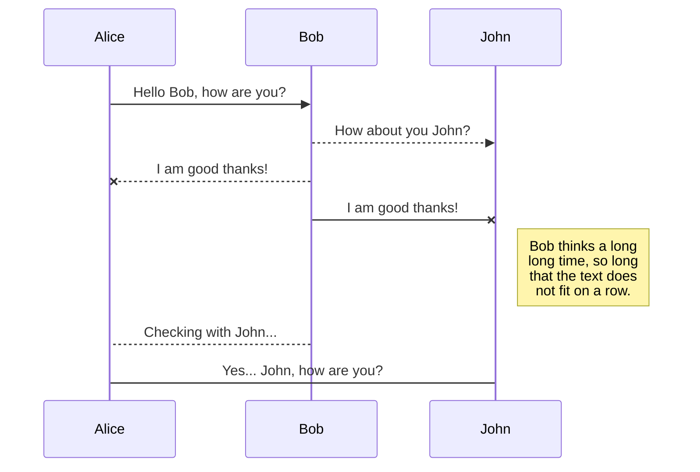
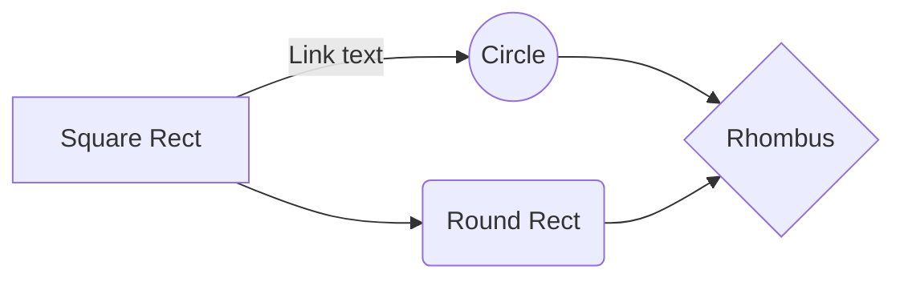

Here I'm talking about markdown support in 3 platforms: Github, StackEdit, Typora. Using my cheat sheet (as shown below).
- Github/Gist support only basic formats. [See below](https://gist.github.com/WangQianEve/35886b24fb0a238861046b6428157afa#title)
- Typora is a local editor, support most format in my cheatsheet (except Superscript and Subscript cannot be previewed). There're a lot of shortcut to boost efficiency. So I use it to actually write. [View pdf](https://drive.google.com/open?id=1y2A_yzLRUvwWV3pl_n6IIuEbWseEbF7l).
- StackEdit is an online editor, support collaboration and syncronizing from google drive/github. It support all the format in this cheat sheet (it's easier to adjust image size). [View in google drive](https://drive.google.com/open?id=1sPxe54NthRrSl-LRTpz07fgKST_JWngd).

And I also tested with Medium, only basic format are supported, so I'd still recommend write Medium article in Medium editor, and make use of their functions like unsplash etc.

---

# title
## 2 title
### 3 title
#### 4 title
##### 5 title
plain text with comment

<u>underline text in html</u>

<span style="color:blue">some *blue* text</span>

==hightlight text==

Text^Superscript^

Text~subscript~

<!--comment-->

$math^p_d$

~~strike through text~~

 - [ ] Checkbos list item

> Blockquote

inline `code`

```python
a = block
if a==1;
	print a
```

| head | col 1 |
| ---- | ----- |
| name | qian  |

## links
[I'm an inline-style link](https://www.google.com)

[I'm an inline-style link with title](https://www.google.com "Google's Homepage")

[I'm a reference-style link][Arbitrary case-insensitive reference text]

I'm a relative reference to a repository file

[You can use numbers for reference-style link definitions][1]

Or leave it empty and use the [link text itself].

URLs and URLs in angle brackets will automatically get turned into links. 
http://www.example.com or <http://www.example.com> and sometimes 
example.com (but not on Github, for example).

Some text to show that the reference links can follow later.

[arbitrary case-insensitive reference text]: https://www.mozilla.org
[1]: http://slashdot.org
[link text itself]: http://www.reddit.com

---

## images
- image from url
  
- image with size setting ' =200x'
  

- Reference-style: 
  ![alt text][logo]

[logo]: http://kirkstrobeck.github.io/whatismarkdown.com/img/markdown.png "Logo Title Text 2"

- html \ tag with size setting in `width`
  

## KaTeX

You can render LaTeX mathematical expressions using [KaTeX](https://khan.github.io/KaTeX/):

The *Gamma function* satisfying $\Gamma(n) = (n-1)!\quad\forall n\in\mathbb N$ is via the Euler integral

$$
\Gamma(z) = \int_0^\infty t^{z-1}e^{-t}dt\,.
$$

> You can find more information about **LaTeX** mathematical expressions [here](http://meta.math.stackexchange.com/questions/5020/mathjax-basic-tutorial-and-quick-reference).


## UML diagrams

You can render UML diagrams using [Mermaid](https://mermaidjs.github.io/). For example, this will produce a sequence diagram:



And this will produce a flow chart:


